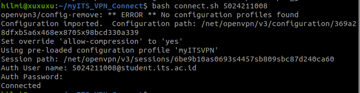
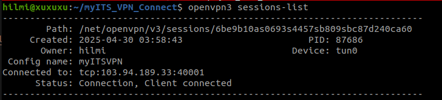

# myITS VPN Connect on Linux

This repository helps you simplify the process of connecting to myITS VPN on a Linux system.

# Prerequisites

- A Linux machine (Ubuntu(tested), Debian)
- Root or sudo access
- myITS active account
- An `.ovpn` configuration file (download it from portal.its.ac.id menu)


# Step-by-Step Instructions

### 1. Install OpenVPN3

#### Ubuntu/Debian:
```bash
# Install the OpenVPN repository key
sudo mkdir -p /etc/apt/keyrings && curl -fsSL https://packages.openvpn.net/packages-repo.gpg | sudo tee /etc/apt/keyrings/openvpn.asc
# Obtain the Linux distribution
DISTRO=$(lsb_release -c -s)
# Install the proper repository
echo "deb [signed-by=/etc/apt/keyrings/openvpn.asc] https://packages.openvpn.net/openvpn3/debian $DISTRO main" | sudo tee /etc/apt/sources.list.d/openvpn-packages.list
# Install the package
sudo apt update
sudo apt install openvpn3
```

### 2. Clone this repository
```bash
git clone https://github.com/mhilmir/myITS_VPN_Connect.git
```

### 3. Run connect.sh

Make sure you've been downloaded .ovpn configuration file from portal.its.ac.id then place it in this repo.

```bash
# make the scripts executable
cd myITS_VPN_Connect/
chmod +x *.sh

# run the script
bash connect.sh {nrp}
```
When it prompted, your auth is :

username = nrp@student.its.ac.id

password = {your myITS password}




# How To Disconnect

### 1. List the current vpn sessions
```bash
openvpn3 sessions-list
```
Find your current session, then copy the path



### 2. Run disconnect script
```bash
bash disconnect.sh {vpn_path}
```