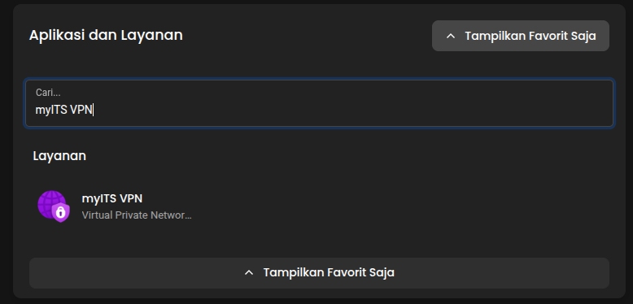

# myITS VPN Connect on Linux

This repository helps you simplify the process of connecting to myITS VPN on a Linux system.

## Prerequisites

- A Linux machine (Ubuntu(tested), Debian)
- Root or sudo access
- An `.ovpn` configuration file (download it from portal.its.ac.id menu)




## Step-by-Step Instructions

### 1. Install OpenVPN3

#### Ubuntu/Debian:
```bash
# Install the OpenVPN repository key
sudo mkdir -p /etc/apt/keyrings && curl -fsSL https://packages.openvpn.net/packages-repo.gpg | sudo tee /etc/apt/keyrings/openvpn.asc
# Obtain the Linux distribution
DISTRO=$(lsb_release -c -s)
# Install the proper repository
echo "deb [signed-by=/etc/apt/keyrings/openvpn.asc] https://packages.openvpn.net/openvpn3/debian $DISTRO main" | sudo tee /etc/apt/sources.list.d/openvpn-packages.list
# Install the package
sudo apt update
sudo apt install openvpn3
```

### 2. 
